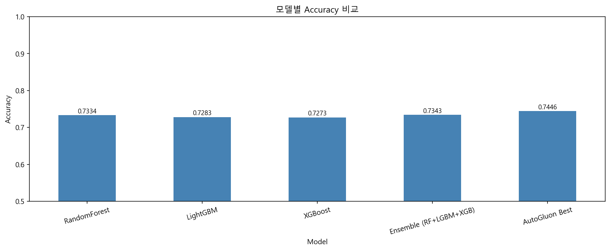
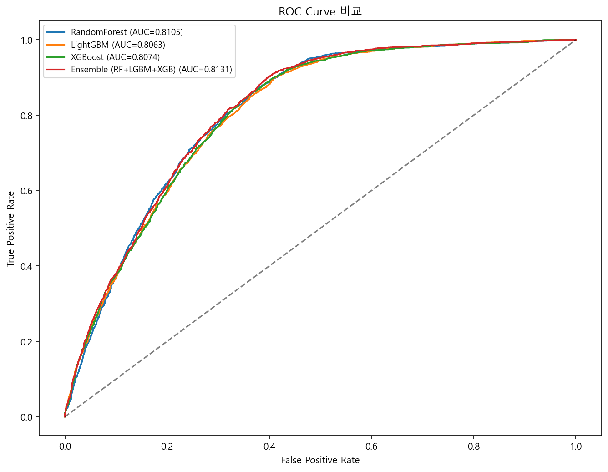
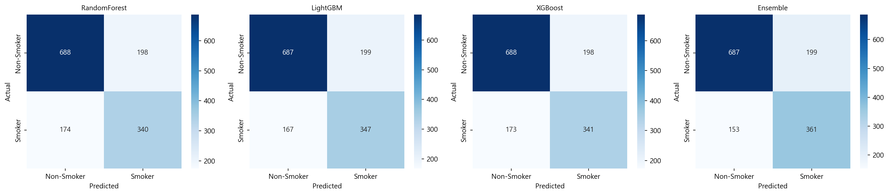
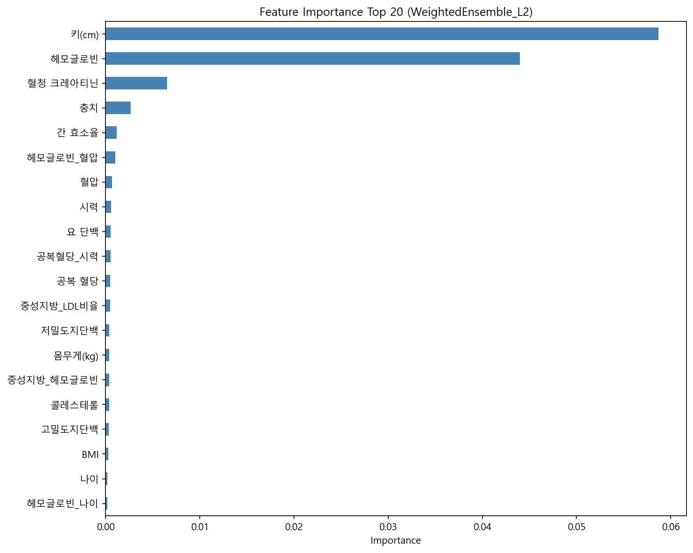

# 🚬 건강 검진 데이터 기반 흡연 여부 예측

건강 검진 수치를 활용하여 **흡연 여부(smoker / non-smoker)**를 예측하는 **이진 분류 머신러닝 프로젝트**입니다.

건강 검진 지표와 혈액 검사 수치를 기반으로 흡연 여부를 예측하고,

EDA → Feature Engineering → Model Training → AutoML → Ensemble 과정을 통해 모델 성능을 개선했습니다.

---

# 🎯 Problem Statement

흡연은 심혈관 질환, 당뇨, 암 등 다양한 질환의 주요 위험 요인입니다.

하지만 실제 건강검진 데이터에서는 흡연 여부가 누락되거나 정확하지 않은 경우가 존재합니다.

본 프로젝트의 목표는 **건강 검진 수치만으로 개인의 흡연 여부를 예측할 수 있는 머신러닝 모델을 구축하는 것**입니다.

이를 통해

- 건강 위험도 분석
- 건강검진 데이터 보완
- 예방 의료 분석

등에 활용 가능한 모델을 개발하는 것을 목표로 합니다.

---

# 📊 데이터셋

| 구분 | 샘플 수 | 피처 수 |
| --- | --- | --- |
| Train | 7,000 | 16 |
| Test | 3,000 | 15 |

**주요 변수**

- 나이 (Age)
- 키 / 몸무게
- BMI
- 시력
- 공복 혈당
- 혈압
- 중성 지방 (Triglycerides)
- 콜레스테롤
- 헤모글로빈

건강검진 기반 **대사 건강 지표**가 포함된 데이터입니다.

---

# 🗂️ 프로젝트 구조

```
├── data/                          # 원본 및 전처리 데이터
│   ├── train.csv
│   ├── test.csv
│   └── sample_submission.csv
├── notebooks/                     # 단계별 분석 노트북
│   ├── 01_EDA.ipynb               # 데이터 탐색
│   ├── 02_Preprocessing.ipynb     # 전처리 및 피처 엔지니어링
│   ├── 03_modeling.ipynb          # 모델 학습 및 튜닝
│   └── 04_Evaluation.ipynb        # 평가 및 시각화
├── outputs/                       # 모델 저장 및 제출 파일
│   └── figures/                   # 시각화 이미지
│       ├── model_comparison.png
│       ├── confusion_matrix.png
│       ├── roc_curve.png
│       └── feature_importance.png
├── requirements.txt
└── README.md
```

---

# 🔍 분석 파이프라인

## 1️⃣ 데이터 탐색 (EDA)

- 변수별 분포 확인 (히스토그램 + 박스플롯)
- 결측치·이상치 탐지
- 상관관계 히트맵 분석
- 타겟 변수와의 상관계수 Top 10 Feature 분석

---

## 2️⃣ 데이터 전처리

### 결측치 처리

- 평균값 대체

### 이상치 처리

- IQR 기반 클리핑
- 의학적 정상 범위 기반 클리핑

### Feature Engineering

생성된 주요 파생 변수

- 지질 비율 (Lipid Ratio)
- 비만도 지표
- 대사증후군 점수
- 변수 간 교호작용

총 **30개 이상의 파생 변수 생성**

### Clustering Feature

- **KMeans 기반 군집 Feature 추가**

---

## 3️⃣ 모델링

### 기본 모델 비교

- RandomForest
- LightGBM
- XGBoost

**5-Fold Cross Validation** 기반 성능 비교

---

### 하이퍼파라미터 튜닝

- Optuna

튜닝 대상 모델

- LightGBM
- XGBoost

---

### AutoML

AutoGluon `best_quality`

- Auto Stacking
- Bagging
- 10-Fold Cross Validation

---

### Ensemble

상위 모델 기반 **Soft Voting Ensemble**

---

# 🏆 주요 결과

| Model | Accuracy | Precision | Recall | F1-score |
| --- | --- | --- | --- | --- |
| RandomForest | 0.7334 | 0.6384 | 0.6328 | 0.6353 |
| LightGBM | 0.7283 | 0.6305 | 0.6282 | 0.6291 |
| XGBoost | 0.7273 | 0.6291 | 0.6266 | 0.6277 |
| Ensemble (RF+LGBM+XGB) | 0.7343 | 0.6379 | 0.6391 | 0.6382 |
| **AutoGluon Best** | **0.7446** | - | - | - |

AutoGluon Best Model이 단일 모델 대비 **약 1~2% 성능 향상**을 보였습니다.

> AutoGluon은 내부 10-Fold Bagging OOF score 기준이며 Precision/Recall/F1은 제공되지 않습니다.

---

# 📈 Visualization

모델 분석에 사용한 주요 시각화입니다. (`04_Evaluation.ipynb` 실행 시 자동 생성)

| 모델별 Accuracy 비교 | ROC Curve |
|:---:|:---:|
|  |  |

| Confusion Matrix | Feature Importance |
|:---:|:---:|
|  |  |

---

# 🔬 Feature Importance Insight

모델 분석 결과 흡연 여부 예측에 중요한 변수는 다음과 같습니다.

- **Hemoglobin**
- **Triglycerides**
- **BMI**
- **Cholesterol**

이 변수들은 흡연과 관련된 **대사 건강 변화와 밀접한 관련**이 있는 것으로 나타났습니다.

---

# 🛠️ 기술 스택

**언어**

- Python

**데이터 분석**

- Pandas
- NumPy

**시각화**

- Matplotlib
- Seaborn

**머신러닝**

- Scikit-learn
- LightGBM
- XGBoost

**AutoML**

- AutoGluon

**하이퍼파라미터 튜닝**

- Optuna

**클러스터링**

- KMeans

---

# ⚙️ 실행 방법
- Python 3.11버전에서 진행

```
pip install -r requirements.txt
```

**노트북 실행** (`notebooks/` 폴더를 01 → 02 → 03 → 04 순서로 실행)

```
01_EDA.ipynb → 02_Preprocessing.ipynb → 03_modeling.ipynb → 04_Evaluation.ipynb
```

**단일 파일 실행**

```
python main.py
```

`04_Evaluation.ipynb` 실행 시 `outputs/figures/` 경로에 시각화 이미지가 자동 저장됩니다.

---

# 💡 Key Takeaways

- 건강 검진 데이터 기반 Feature Engineering이 모델 성능 향상에 중요한 역할
- AutoML + Ensemble 접근 방식이 단일 모델 대비 더 안정적인 성능 제공
- 대사 관련 지표 (Triglycerides, BMI, Hemoglobin)가 흡연 예측에서 중요한 Feature로 확인됨
